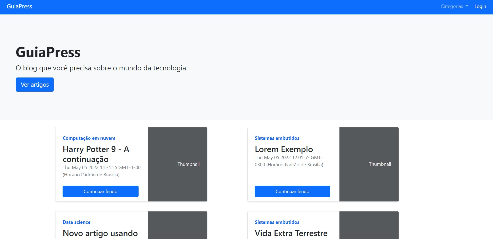
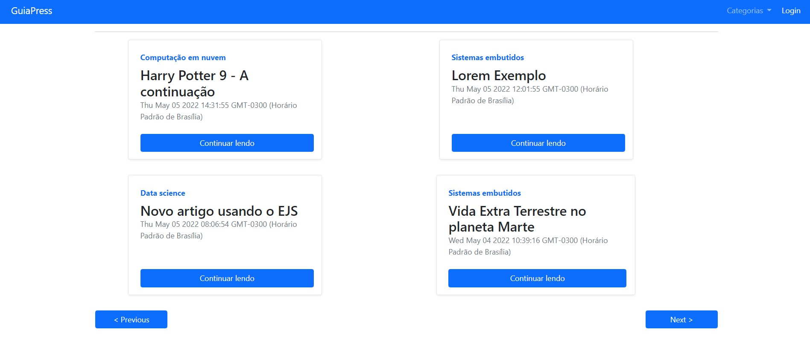
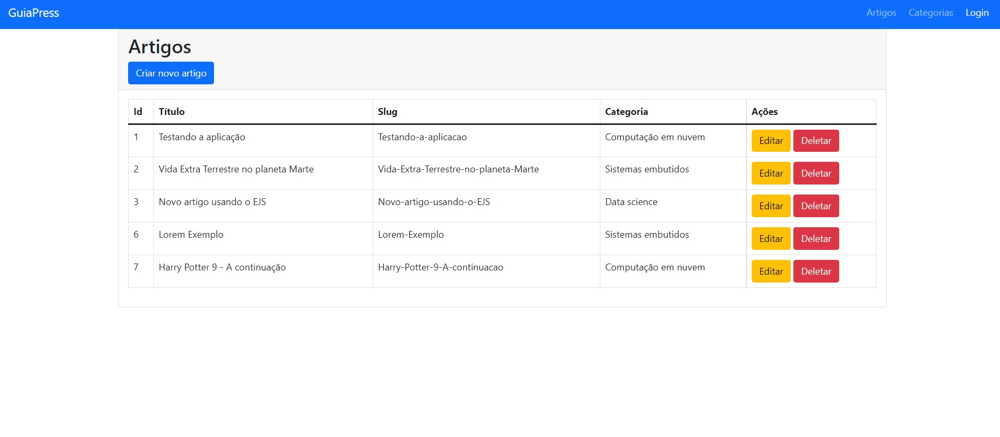
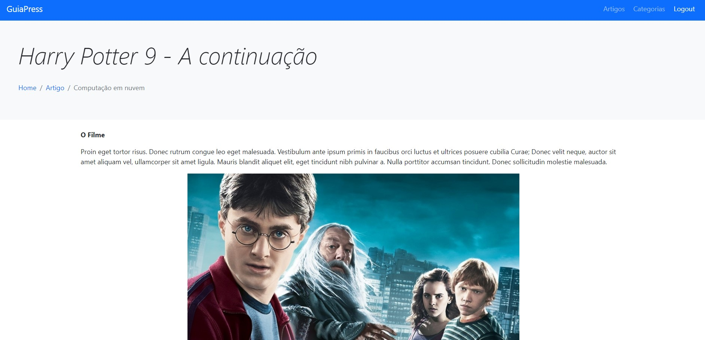

# Blog GuiaPress

  
  
  

 

Blog com sistema de login de administradores desenvolvido usando a view engine EJS com o backend em NodeJS e banco de dados em MySQL usando a biblioteca Sequelize.

  
  
  
  

## Como iniciar o projeto

  
Iniciando o projeto

  <ul>
    <li>Clone este repositório na sua máquina.</li>
    <li>Instale o <a href="https://bit.ly/3B6DxZn">MySQL Community e Workbench.</a></li>
    <li>Abra o MySQL Workbench e crie uma tabela chamada <code>guiapress</code></li>
    <li>Após isso, entre na pasta do projeto pelo CMD e digite o comando <code>node index.js</code></li>
  </ul>

## Frameworks e Bibliotecas

- [x] NodeJS
- [x] MySQL2 
- [x] Sequelize
- [x] Express
- [x] Express Session
- [x] Bcrypt
- [x] EJS
- [x] Nodemon

## Desenvolvimento

<table>
  <tr>
    <td border="1px solid #ddd" align="center">
      <a href="https://github.com/wesleysantossts">
        
         
        Wesley Santos
      </a>
    </td>
  </tr>
</table>